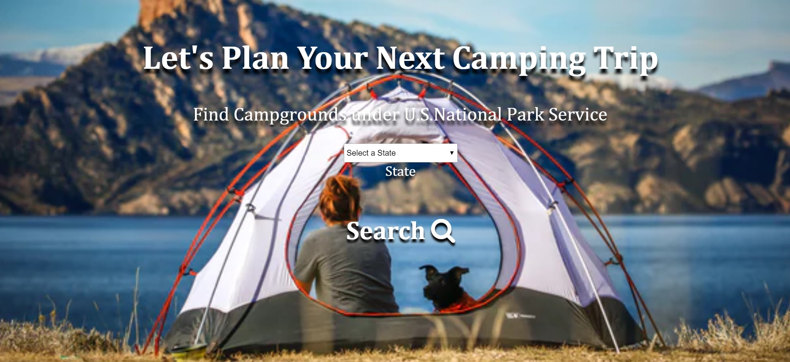
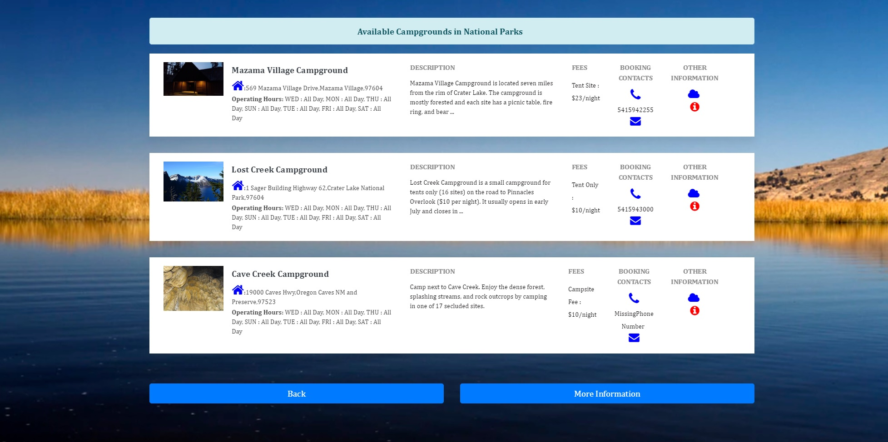
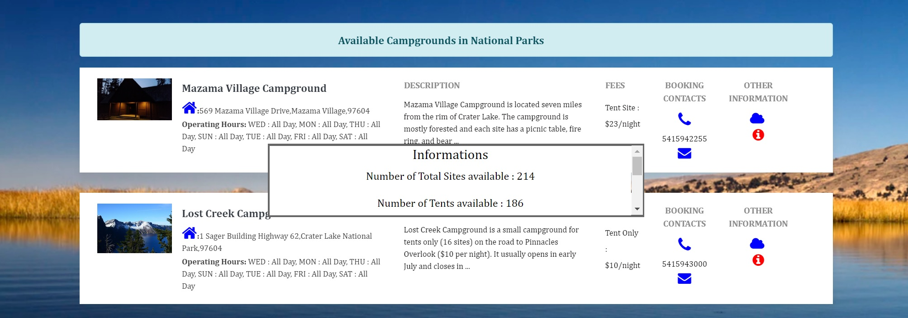
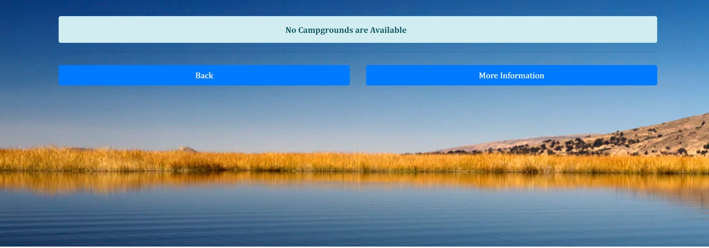

# Camping Planner

#### Target Audience
  - International as well as domestic visitors in the United States who would like to enjoy the joy of camping under the comfort and security of the **National Parks Services** campgrounds.

#### Overview
  A very simple App to help get a consolidated list of available campgrounds with detailed information regarding the total number of campsites, tent-only sites, RV sites etc. The app also lets you know the nightly fees, physical address, as well as generic weather overview for you to plan ahead.
  
  Please note that this App will only list the campgrounds available within the jurisdiction of the National Parks Service. So, if you would want to vist any campgrounds under the State Parks, please contact them directly or visit their websites.

##### How to use the app

Just open the app and select your desired state where you would like to plan your next camping trip. A dropdown box with all the state names are listed in alphabetical order. The dropdown supports smart typing, so if you are looking for 'Washington' state, typing - 'w' and then 'a' will bring you to your desired selection. Clicking on the **Search** image button triggers the search.

Fig-1 shows an user in the first page

Lets consider that the user has searched for campgrounds under 'Oregon' state.
Give the app a few seconds while it fetches the latest information and arranges them for you. You will be shown a campfire image in the meantime, indicating your data is being prepared.

Fig-2 shows you an user waiting for data to appear

The campground information will be displayed in no time. When the search results page, appears you will see a listing of all the available campgrounds, and most of these listings are accompanied with an image that shows that campground or its nearby place to give you an idea of the location.
The results page also contains the following information:
 -- Campground Name
 -- Campground Physical Address (either the full street address or the location co-ordinates, for your GPS)
 -- Campground Description (The description will be truncated, but full description is available on tooltip)
 -- Nightly Fees - the per night cost
 -- Booking Contacts - Phone Number and E-Mail Address for help in your booking
 -- Weather Overview - a brief weather overview
 -- Miscellaneous Information - the total number of campsites, tent-only sites, RV sites etc.

Fig-3 shows an user's search results for the state of Oregon

**Tips:** 
- Clicking on the *Weather* or *Information* icons will open a popup with relevant information.
- Clicking on the *Email* icon will open your desktop mailbox.

Fig-4 shows the popup opening after the user clicked on the `Information` icon

**Note**: If you select a state/ province that do not have any campgrounds *(for example Guam)*, you will just see an empty page. Please use the 'Back' button to return back to the first page, or use the 'More Information' button to visit the NPS website! Thanks for visiting.

Fig-5 shows an empty results page for the Guam province

##### Technical Know-How
The Camping Planner app uses AJAX calls to request and load data asynchronously from public APIs (listed below) in response to user click events detected by event-handlers. Using jQuery DOM taversal and manipulation, the data is displayed in an organized layout that has been made responsive and mobile-first by CSS media-queries, allowing the page to be usable and equally optimized on devices with small and large screens alike.
The complete data set is fetched from multiple public API's in the below order:
- Fetch all campground information 
- Extract the required/ relevant address information
- Fetch the campground photo if available

# Public API's used!

  - NPS *(National Park Service's)* /campgrounds API
  - Google MAPS API *(/place/textsearch/)* API
  - Google MAPS API *(/place/photo)* API
